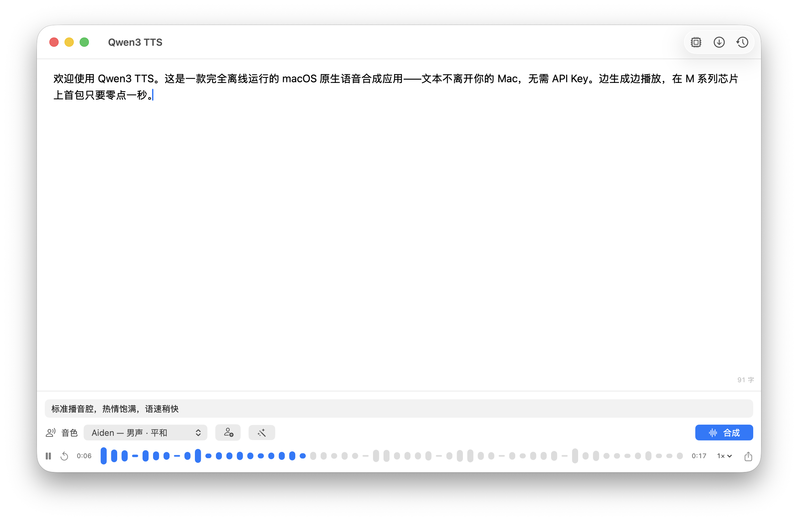
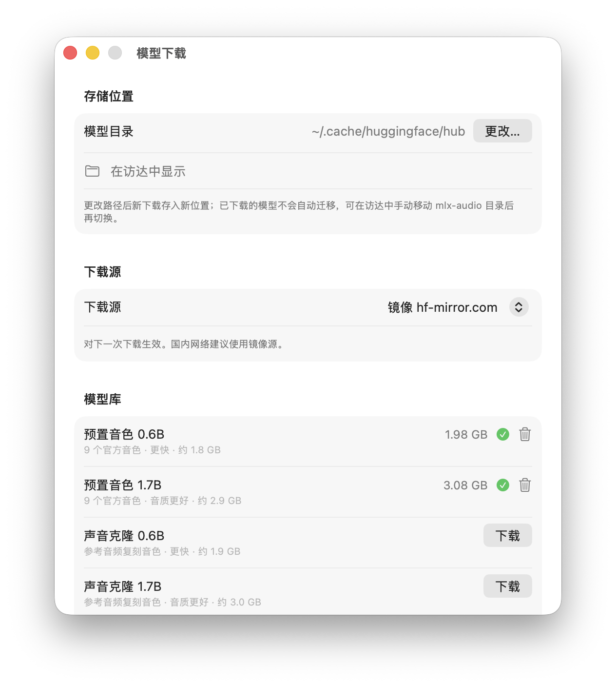
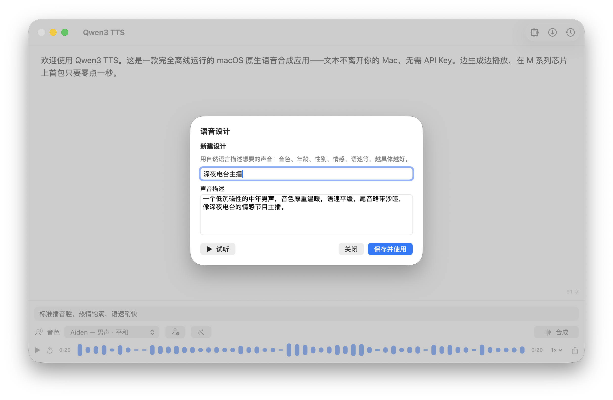

# Qwen3 TTS for macOS

macOS 原生的 Qwen3-TTS 本地推理客户端。完全离线运行——文本不离开你的 Mac，无需 API Key，无按量计费。



## 安装

从 [Releases](../../releases) 下载最新的 `Qwen3TTS-v*-arm64.zip`，解压后把 `Qwen3 TTS.app` 拖进「应用程序」。

> 应用为 ad-hoc 签名（未经 Apple 公证），首次打开请**右键 →「打开」**，
> 或运行 `xattr -cr "/Applications/Qwen3 TTS.app"` 移除隔离属性。

首次启动会引导下载模型（0.6B 约 1.8 GB），此后完全离线。

## 功能

- **流式合成**：边生成边播放，M 系列芯片上首包约 0.1 秒（实测 M3 Max，8bit 量化）
- **三种发声方式**：9 个官方预置音色（含北京话、四川话方言）/ **声音克隆**（3 秒参考音频复刻）/ **语音设计**（自然语言描述凭空造声音，支持试听迭代）
- **风格指令**：如「用温柔的语气慢慢说」，每次合成级别的情感/语气控制
- **长文本**：按句子边界自动分段，整篇文章无缝连续播放
- **真实音频波形**：由合成采样实时绘制，点按/拖动跳转，0.5×~2× 变速不变调
- **菜单栏常驻 + 全局快捷键**：任意 App 里 ⌘C 复制后按 ⌃⌥⌘S 即刻朗读，再按停止（快捷键可在设置中更换）
- **模型下载中心**：官方 / 镜像 / 自定义下载源，自定义存储路径，下载进度与磁盘管理
- **细粒度配置**：模型规格（0.6B 快 / 1.7B 音质好）、10 语种、采样参数、流式分块、内存加载管理
- 历史记录持久化、WAV / m4a 导出

| 模型下载中心 | 语音设计 |
|---|---|
|  |  |

## 系统要求

- Apple Silicon（M1 及以上）
- macOS 14+
- 磁盘：每个模型约 1.8 ~ 3 GB；内存：加载一个模型约 2 GB

## 构建

需要完整 Xcode（含 Metal 工具链——mlx-swift 的限制，SwiftPM 命令行编不了 Metal shaders）：

```sh
# 打包 .app（构建 + 组装 + ad-hoc 签名，产物在 dist/）
scripts/package-app.sh

# 开发内循环（TTSCore/UI，不涉及 MLX）
swift test
QWEN3TTS_FAKE_ENGINE=1 swift run Qwen3TTSApp   # 假引擎跑 UI
```

更多构建细节见 [CLAUDE.md](CLAUDE.md)。

## 架构

```
Sources/
├── TTSCore/        # 零 MLX 依赖：InferenceEngine 契约、流式播放、分段、持久化
├── TTSEngineMLX/   # MLX 推理引擎 + 模型下载管理（唯一接触 MLX 的模块）
└── Qwen3TTSApp/    # SwiftUI 界面层
```

核心契约是 `InferenceEngine`：文本 + 音色 + 选项 → 异步音频块流。运行时细节全部隐藏在接口后面（选型依据见 [ADR-0001](docs/adr/0001-inference-runtime-mlx-swift.md)，实测数据见 [spike 记录](docs/generated/spike-inference-runtime.md)）。

## 致谢

- [Qwen3-TTS](https://github.com/QwenLM/Qwen3-TTS)（Apache 2.0）— 通义千问开源 TTS 模型
- [mlx-audio-swift](https://github.com/Blaizzy/mlx-audio-swift)（MIT）— Apple Silicon 原生推理运行时
- 量化权重来自 [mlx-community](https://huggingface.co/mlx-community)

## 许可证

[MIT](LICENSE)
